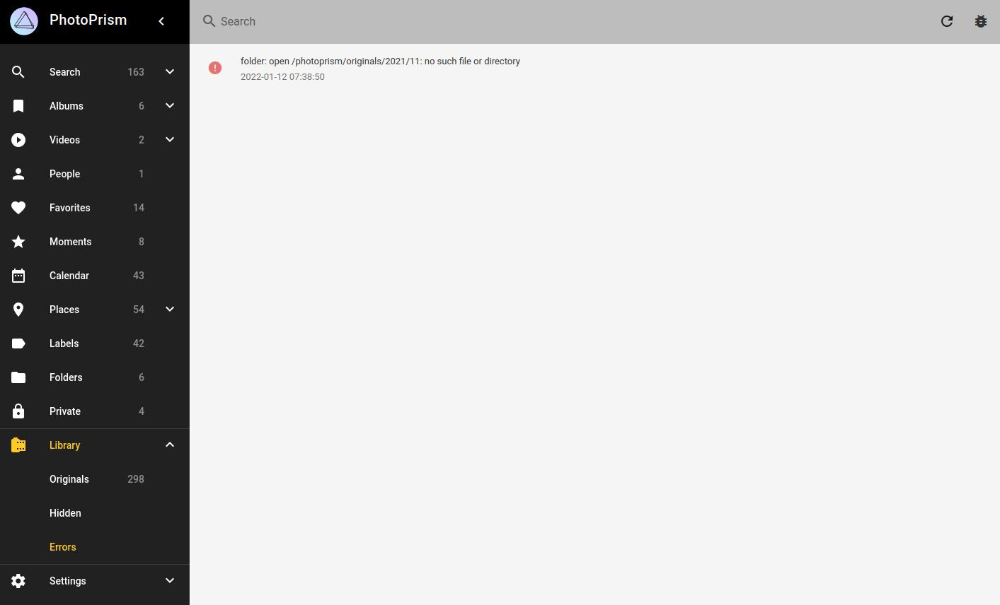

# Collecting Debug Information

=== "Web App"

    Make sure *Logs* is enabled under *Settings* > *General* so you can see log messages in the Web UI.

    **Live Logs**

    The continuously updated live logs in *Library* > *Logs* are especially useful for diagnosing indexing and import issues,
    but also display other types of logs (depending on the [log level](../config-options.md#basic-settings)):

    1. Navigate to *Library*
    2. Open the *Logs* tab
   
    !!! note ""
        Only a limited number of messages are visible in the Web App to reduce memory usage. You can see all messages
        in the [Docker Logs](docker.md#viewing-logs). This may be more convenient if you are looking for information
        on a specific file or want to attach your full logs to a [support request](../../user-guide/index.md#getting-support).

    **Errors and Warnings**

    1. Expand the main navigation
    2. Open the *Library* sub navigation
    3. Navigate to *Library* > *Errors*

    

=== "Browser"
    
    If you [have a frontend issue](browsers.md), it is often helpful to check the browser console for errors and warnings.
    A console is available in all modern browsers and can be activated via keyboard shortcuts or the browser menu.

    Problems with the user interface can be caused by a bug or an [incompatible browser](browsers.md#try-another-browser):
    Some [features may not be supported](https://caniuse.com/) by non-standard browsers, as well as nightly, test,
    and unofficial versions.

    !!! tldr ""
        In case you don't see any log messages, try reloading the page, as the problem may occur while the page is loading.
    
    **Chrome, Chromium, and Edge**

    - press ⌘+Option+J (Mac) or Ctrl+Shift+J (Windows, Linux, Chrome OS) to go directly to the Developer Tools
    - or, navigate to *More tools* > *Developer tools* in the browser menu and open the *Console* tab

    **Firefox**

    - press ⌘+Option+K (Mac) or Ctrl+Shift+K (Windows) to go directly to the Firefox Web Console panel
    - or, navigate to *Web Development* > *Web Console* in the menu and open the *Console* panel

    **Safari**

    Before you can access the console in Safari, you first need to enable the *Develop* menu:

    1. Choose Safari *Menu* > *Preferences* and select the *Advanced Tab*
    2. Select "Show Develop menu in menu bar"

    Once the *Develop* menu is enabled:

    - press Option+⌘+C to go directly to the *Javascript Console*
    - or, navigate to *Develop* > *Show Javascript Console* in the browser menu

=== "Docker Logs"

    Run this command to display the last 100 log messages (omit `--tail=100` to see all):

    ```bash
    docker-compose logs --tail=100
    ```
    
    To enable [debug mode](../config-options.md), set `PHOTOPRISM_DEBUG` to `true` in the `environment:` section
    of the `photoprism` service (or use the `--debug` flag when running the `photoprism` command directly):
    
    ```yaml
    services:
      photoprism:
        environment:
          PHOTOPRISM_DEBUG: "true"
    ```
    
    Then restart all services for the changes to take effect. It can be helpful to keep Docker running in the foreground
    while debugging so that log messages are displayed directly. To do this, omit the `-d` parameter when restarting:
    
    ```bash
    docker-compose stop
    docker-compose up 
    ```
    
    !!! note ""
        If you see no errors or no logs at all, you may have started the server on a different host
        and/or port. There could also be an [issue with your browser](browsers.md), browser plugins, firewall settings,
        or other tools you may have installed.
    
    !!! tldr ""
        The default [Docker Compose](https://docs.docker.com/compose/) config filename is `docker-compose.yml`. For simplicity, it doesn't need to be specified when running the `docker-compose` command in the same directory. Config files for other apps or instances should be placed in separate folders.

!!! info ""
    You are welcome to ask for help in our [community chat](https://gitter.im/browseyourlife/community).
    [Sponsors](../../funding.md) receive direct [technical support](https://photoprism.app/contact) via email.
    Before [submitting a support request](../../user-guide/index.md#getting-support), try to [determine the cause of your problem](index.md).
