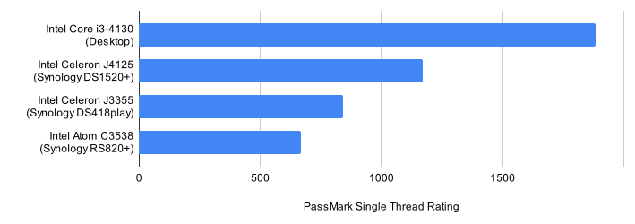

# Performance Tips

## MariaDB ##

The [InnoDB buffer pool](https://mariadb.com/kb/en/innodb-buffer-pool/) serves as a cache for data and indexes.
It is a key component for optimizing MariaDB performance. Its size should be as large as possible to keep frequently
used data in memory and reduce disk I/O - typically the biggest bottleneck.

By default, the size of the buffer pool is only 128 MB. You can change it using the `--innodb-buffer-pool-size`
parameter in the database service config of your `docker-compose.yml`. `M` stands for Megabyte, `G` for Gigabyte.
Do not use spaces.

If your server has plenty of physical memory, we recommend increasing the size to 1 or 2 GB:

```yaml
services:
  mariadb:
    command: mysqld --innodb-buffer-pool-size=1G ...
```

!!! note ""
    Remember to also [increase the memory available to services](../img/docker-resources-advanced.jpg) in case you are
    using *Docker Desktop* on Windows or macOS. If PhotoPrism and MariaDB are running in a virtual machine, the available
    memory must be increased as well. For details, refer to the corresponding documentation.

## Storage ##

Local Solid-State Drives (SSDs) are [best for databases](https://mariadb.com/de/resources/blog/how-to-tune-mariadb-write-performance/)
of any kind:

- database performance extremely benefits from high throughput which HDDs can't provide
- SSDs have more predictable performance and can handle more concurrent requests
- due to the HDD seek time, HDDs only support 5% of the reads per second of SSDs
- the cost savings from using slow hard disks are minimal

Switching to SSDs makes a big difference, especially for write operations and when the read cache is not
big enough or can't be used.

!!! note ""
    Never store database files on an unreliable device such as a USB flash drive, an SD card, or a shared network folder.

## Memory ##

Indexing large photo and video collections benefits from plenty of memory for [caching](#mariadb) and processing large media files.
Ideally, the amount of RAM should match the number of physical CPU cores. If not, reduce the number of workers 
as [explained below](#troubleshooting).

Especially the conversion of RAW images and the transcoding of videos are very demanding. High-resolution panoramic
images may require [additional swap space](docker.md#adding-swap) and/or physical memory above the [recommended minimum](../index.md#system-requirements).

!!! note ""
    RAW image conversion and TensorFlow are disabled on systems with 1 GB or less memory. We take no responsibility
    for instability or performance problems if your device does not meet the requirements.

## Server CPU ##

Last but not least, performance can be limited by your server CPU. If you've tried everything else, then only moving
your instance to a more powerful device or cloud server may help.

Be aware that most [NAS devices](https://kb.synology.com/en-us/DSM/tutorial/What_kind_of_CPU_does_my_NAS_have) are
optimized for minimal power consumption and low production costs. Although their hardware gets faster with each generation,
[benchmarks](https://www.google.com/search?q=cpu+benchmarks) show that even 8-year-old standard desktop CPUs like the [Intel Core i3-4130](https://www.cpubenchmark.net/compare/Intel-Pentium-J3710-vs-Intel-i3-4130/2784vs2015) are often many times faster:



## Troubleshooting ##

If your server runs out of memory, the index is frequently locked, or other system resources are running low:

- [ ] Try [reducing the number of workers](../config-options.md#index-workers) by setting `PHOTOPRISM_WORKERS` to a reasonably small value in `docker-compose.yml`, depending on the CPU performance and number of cores
- [ ] Make sure [your server has at least 4 GB of swap space](docker.md#adding-swap) so that indexing doesn't cause restarts when memory usage spikes; RAW image conversion and video transcoding are especially demanding 
- [ ] If you are using SQLite, switch to MariaDB, which is [better optimized for high concurrency](../faq.md#should-i-use-sqlite-mariadb-or-mysql)
- [ ] As a last measure, you can [disable the use of TensorFlow](../config-options.md#feature-flags) for image classification and facial recognition

Other issues? Our [troubleshooting checklists](index.md) help you quickly diagnose and solve them.

!!! info ""
    You are welcome to ask for help in our [community chat](https://gitter.im/browseyourlife/community).
    [Sponsors](../../funding.md) receive direct [technical support](https://photoprism.app/contact) via email.
    Before [submitting a support request](../../user-guide/index.md#getting-support), try to [determine the cause of your problem](index.md).

*[SQLite]: self-contained, serverless SQL database 
