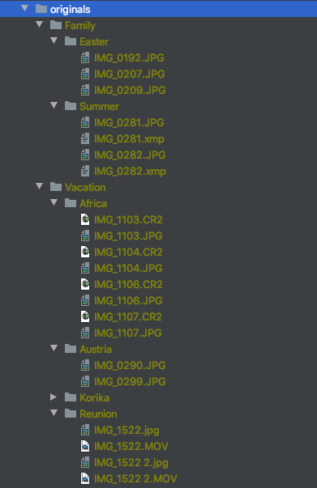
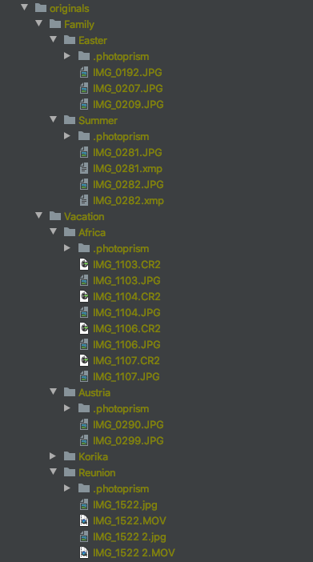
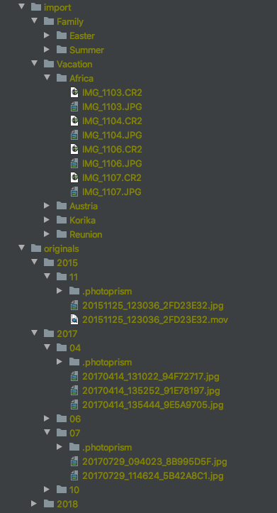
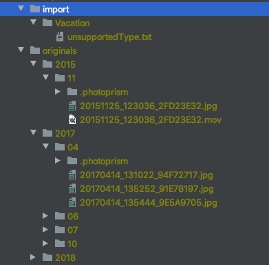

# Shall I import or index my orginals?

Import is a temporary folder from which you can move or copy files to originals in a structured way that avoids duplicates. 
Most users with existing collections will want to index their originals directly without importing them, 
so that existing file and directory names stay the same. On the other hand, 
importing is more efficient when adding files as you don't need to re-index all originals to find new photos and videos.

### Index ###

Use index when you want to index your photos and videos directly in the `originals` folder without copying,
moving or renaming them in any way.

Your folder structure might look like this:

   
     
**During indexing:**

* Files are not renamed or moved.
* Your existing folder structure remains. You might decide to have your folders displayed as albums in PhotoPrism.
* Metadata from your files is read to create labels, titles and locations for your photos.
* Thumbnails are rendered for JPEGs.
* Optionally json and or yml files containing metadata are created

After indexing your originals folder might look like this:

  

    

#### Advantages ####

* You keep your existing folder structure.
* You can display your existing folder structure in PhotoPrism.

### Import ###

Importing is more efficient when adding files as you don't need to re-index all originals to find new photos and videos.
Uploads will also be treated as import, you can't directly upload to originals (yet).

Your initial folder structure in `import` might look like this:

   
   
**During import:**
 
* Files are moved or copied from import directory to originals directory.
* In the originals directory files are renamed and get a new folder structure. The original name is saved as property of the file.
* All imported files are indexed.

After import using "copy" (this is the default) your folders could look like this:

   

After import using "move" your folders might look like this:

   

#### Advantages ####
* You will not have duplicates or files with an unsupported type in you Originals folder. Duplicates or unsupported files stay untouched in the import directory. 

!!! info
    Original file and folder names are used to create keywords. 
    In case you import and index or only index a directory with the path "Vacation/Africa". All files from this folder get the keywords "vacation" and "africa".

### Conclusion ###
In case you have no organization in your existing photo collection and you assume you have many duplicates on various hard drives.
Import is the way to go. It will organize all your photos and videos due to time taken and it will avoid duplicates.

In case you have your photo collection organized nicely in folders and you prefer to keep this organization displayed in the filesystem. Index will be the right option for you.
