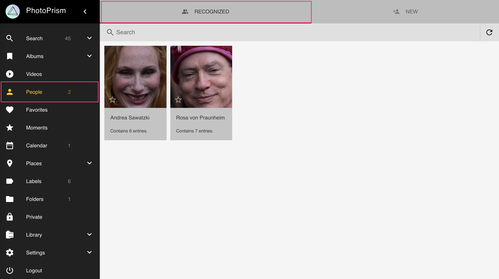
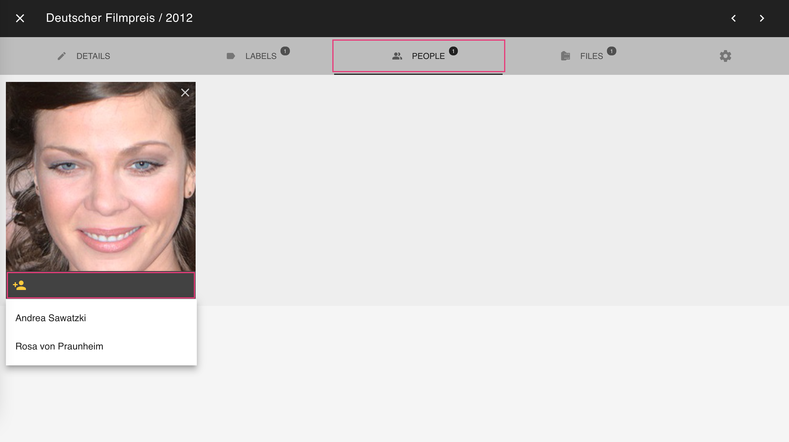
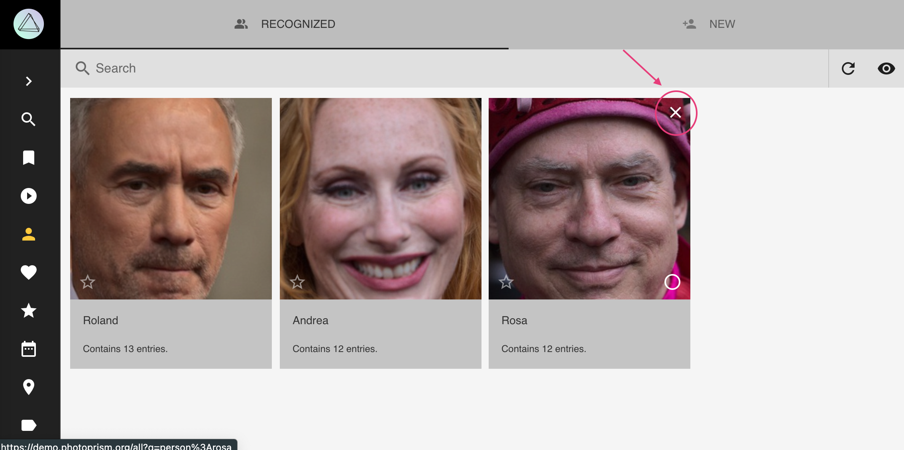
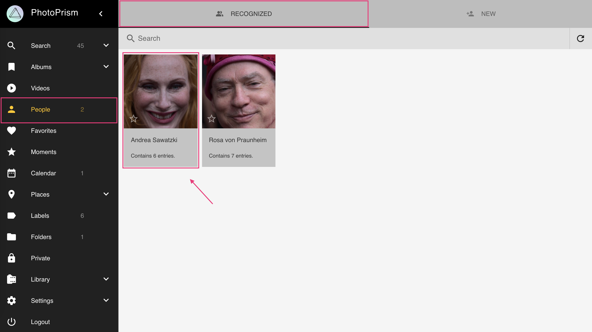
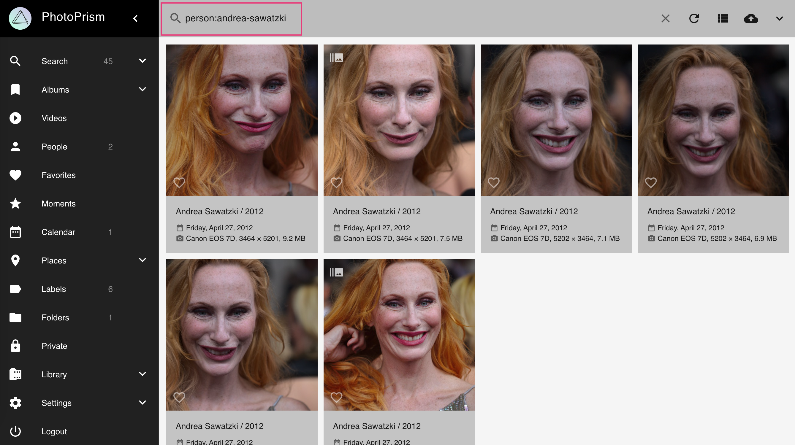
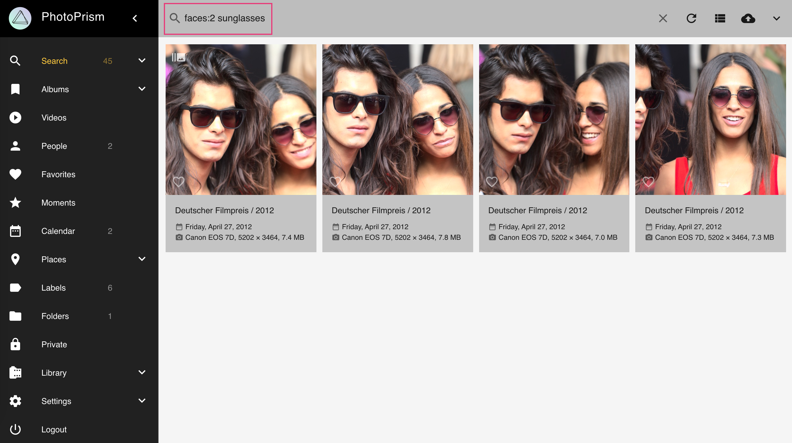

# Facial Recognition

Our [latest version](../../release-notes.md) includes facial recognition that lets you find pictures of your 
family and friends. Be ready to discover long-forgotten shots! New faces are detected as you scan your library. 
They are then grouped by similarity, so you can quickly match them to people. 

!!! tldr ""
    Grouping faces to clusters may take a while, depending on your hardware and how many pictures you have.
    It can also cause a temporarily high CPU load. Existing clusters will be automatically optimized in 
    the background, for example after new faces have been identified, you've reported a bad match, or new 
    files have been added to your library.

## Recognized & New People ##

The people section shows you recognized people as well as new face clusters.

To star a person click :material-star:. Stared persons appear first.

!!! info ""
    **The new faces page shows automatically recognized face clusters only.** There may be thousands of 
    unidentified faces in your library including random people such as news speakers or faces on shampoo bottles.
    You can use the search filter `face:new` to find pictures containing unknown people.
    We recommend combining it with other filters, like year or location, when looking for specific people.
    The *People* tab in the photo [edit dialog](edit.md) displays all faces, so you can name them
    or report a bad match by pressing the :material-eject: button.

### When a face was not detected... ###

There can be several reasons why a face was not detected:

- Only the primary file in stacks will be searched for faces
- Faces can be smaller than the minimum size configured
- Our face detection did not scan the image thoroughly enough
- Reducing the resolution or quality of generated [thumbnails](../settings/advanced.md) negatively impacts face detection and recognition results, just like when you cannot see properly
- Contrast plays a major role, so a bright face with gray hair on a gray background may be less obvious to our face detection than it is to you
- In very rare cases an actual face may match a blacklist of false positives, like background noise and food that looks like a face

!!! info "" 
    Recognition compares the similarity of faces. The similarity threshold for a face is reduced when 
    you report a bad match.

## Assign Names to Faces ##

=== "From People"
     1. Go to *People*
     2. Go to *New*
     3. Click on the input field
     4. Start typing a name
     5. Press *enter*

        

=== "From Photo Edit dialog"

      1. Open the photo [*edit dialog*](edit.md)
      2. Go to the *People* tab
      3. Click on the input field
      4. Start typing a name
      5. Press *enter*

        

The person you just added will appear under *Recognized*

## Hiding People ##
You can hide a person in the *Recognized* section by clicking :material-close: in the upper right corner.

!!! example ""
    **This currently is a sponsor feature to thank everyone who supports the development of this application.**
    We'll let you know how to enable it when you sign up on [Patreon](https://www.patreon.com/photoprism) or [GitHub Sponsors](https://github.com/sponsors/photoprism).
    Your continued support [helps us](../../funding.md) provide [regular updates](https://docs.photoprism.app/release-notes/)
    and services like [world maps](https://demo.photoprism.app/places). Thank you! 💜

!!! attention ""
    Pictures of this person continue to be visible in search results and albums.

To see all people including hidden ones click :material-eye:.

Hidden people can be recovered by clicking :material-eye-off:

## Hiding Faces ##
You can hide face clusters from the *New* section, in the same way you [hide people](#hiding-people) from the *Recognized* section.

## View all Photos of a Person ##
=== "From People"
      1. Go to *People*
      2. Go to *Recognized*
      3. Click on the person you want to view

        

=== "From Search"
      1. Go to *Search*
      2. Search for person:"jane-doe"

        

## Rename People ##
To rename all photos of a person:

1. Go to *People*
2. Go to *Recognized*
3. Click on the persons name
4. Type in a new name
5. Press *enter*

## Change People Assignments ##

You may report bad matches by pressing the :material-eject: button underneath a face in the *People* tab.
This will remove the name. You can either leave it blank or enter the name of a different person.

!!! attention ""
    When you reject a match, the corresponding face cluster will be updated in the background so that similar 
    issues can be resolved automatically.

1. Open the photo [*edit dialog*](edit.md)
2. Go to the *People* tab
3. Click :material-eject:
4. Then enter a new name or leave it empty

## Remove Faces ##
In case PhotoPrism detected something wrong as face (false positives), or in case you just don't want to keep a face on the people tab you're not interested in, you can remove it.

1. Open the photo [*edit dialogue*](edit.md)
2. Go to the *People* tab
3. Click :material-close:

You might undo this action before a reload.

## Download all Photos of a Person ##
1. Go to *People*
2. Select a person
3. Open context menu
4. Click :material-download:

## Create Albums from People ##
1. Go to *People*
2. Select a person
3. Open context menu
4. Click :material-bookmark:
5. Select existing album or enter new album name
6. Click *add to album*

## Search ##
You can find photos with people on it using the following queries:

- `people`, `faces` or `faces:true` will result in all photos with people 
- `faces:false` will show all photos without people
- `faces:3` will show all photos with at least 3 people on it
- `person:"John Doe"` or `subject:"John Doe"` will show all photos of the person with the exact name John Doe
- `people:"John"` or `subjects:"John"` will show all photos of people with a name like John e.g. John Doe and John Smith

The person/subject and people/subjects filters can be used with & and | (see [search](search.md) for more details). Filters may be combined.

`person:"John Doe&Jane Doe" faces:3` will show all photos with John and Jane Doe and one other person.

## Coming Soon ##
- Manual face tagging
- Import of xmp face tags
- Save people in backups
- Option to exclude people from library

*[face clusters]: A cluster is a group of faces expected to belong to the same person based on the similarity
