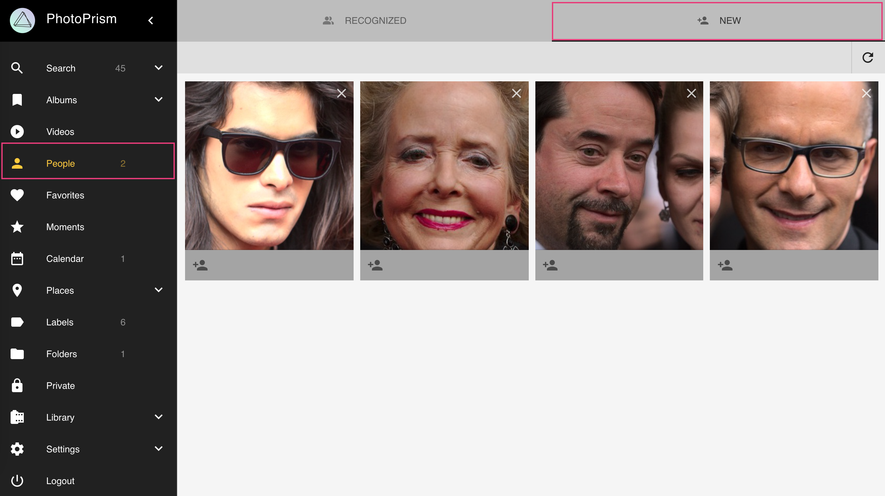
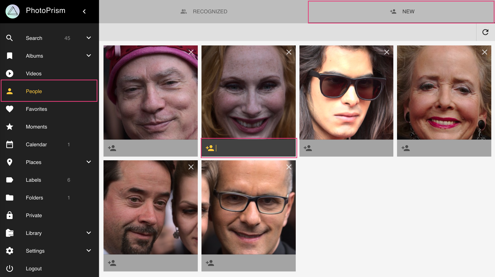
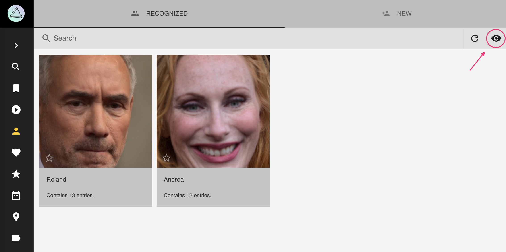
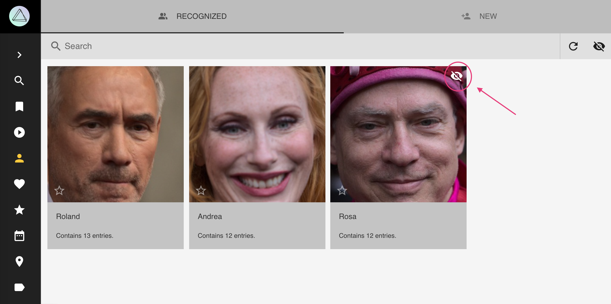
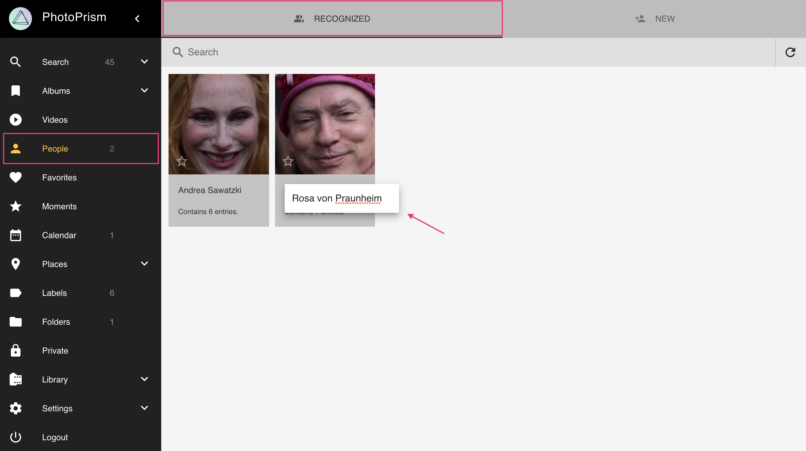

PhotoPrism detects faces while indexing and then groups them by similarity.
This may take a while, depending on how many pictures you have.

!!! tldr ""
    Face clusters are automatically optimized in the background, for example after new faces have 
    been identified, you've reported a conflict, or new files have been added to your library.

## People Section ##

The people section shows you recognized people as well as new face clusters.

To star a person click :material-star:. Stared persons appear first.

!!! info ""
    As not all faces belong to a cluster, there might be more faces than visible in the New section.
    You find all photos with faces that are not assigned to a person using the search filter `face:new`.
    The photo [edit dialog](edit.md) shows all faces of a photo independent of whether they are clustered or not.

### When a face was not detected... ###

There can be several reasons why a face was not detected:

- Only the primary file in stacks will be searched for faces
- Faces can be smaller than the minimum size configured
- Our face detection did not scan the image thoroughly enough
- Reducing the resolution or quality of generated [thumbnails](../settings/advanced.md)
  negatively impacts face detection and recognition results
- In very rare cases an actual face may match a blacklist of false
  positives, like background noise and food that looks like a face

!!! info "" 
    Recognition compares the similarity of detected faces. The standard similarity threshold 
    is reduced when you report conflicts with faces of other people, for example by pressing the
    :material-eject: button to remove a name from a face.

## Assign Names to Faces ##

=== "From People"
     1. Go to *People*
     2. Go to *New*
     3. Click on the input field
     4. Start typing a name
     5. Press *enter*

        

=== "From Photo Edit Dialogue"

      1. Open the photo [*edit dialogue*](edit.md)
      2. Go to the *People* tab
      3. Click on the input field
      4. Start typing a name
      5. Press *enter*

        

The person you just added will appear under *Recognized*

## Hiding People ##
You can hide a person in the *Recognized* section by clicking :material-close: in the upper right corner.

!!! example ""
    **This is an [early-access feature](https://github.com/photoprism/photoprism/issues?q=is%3Aissue+label%3Aearly-access) to [say thanks to our sponsors](https://github.com/photoprism/photoprism/blob/develop/SPONSORS.md) and contributors.**
    We'll let you know how to enable it when you sign up on [Patreon](https://www.patreon.com/photoprism) or [GitHub Sponsors](https://github.com/sponsors/photoprism).
    Your continued support helps us fund operating costs, provide services like satellite maps,
    and develop new features. Thank you very much! 💜

!!! attention ""
    Pictures of this person continue to be visible in search results and albums.

To see all people including hidden ones click :material-eye:.

Hidden people can be recovered by clicking :material-eye-off:

## Hiding Faces ##
You can hide face clusters from the *New* section, in the same way you [hide people](#hiding-people) from the *Recognized* section.

## View all Photos of a Person ##
=== "From People"
      1. Go to *People*
      2. Go to *Recognized*
      3. Click on the person you want to view

        

=== "From Search"
      1. Go to *Search*
      2. Search for person:"jane-doe"

        

## Rename People ##
To rename all photos of a person:

1. Go to *People*
2. Go to *Recognized*
3. Click on the persons name
4. Type in a new name
5. Press *enter*

## Change People Assignments ##
In case the wrong person is assigned to a photo you can easily reject this. 

!!!attention ""
    Each time you reject a face, the face clusters are updated in the background.

1. Open the photo [*edit dialogue*](edit.md)
2. Go to the *People* tab
3. Click :material-eject:
4. Then enter a new name or leave it empty

## Remove Wrong Faces ##
In case PhotoPrism detected something wrong as face (false positives), you can remove it.

1. Open the photo [*edit dialogue*](edit.md)
2. Go to the *People* tab
3. Click :material-close:

You might undo this action before a reload.

## Download all Photos of a Person ##
1. Go to *People*
2. Select a person
3. Open context menu
4. Click :material-download:

## Create Albums from People ##
1. Go to *People*
2. Select a person
3. Open context menu
4. Click :material-bookmark:
5. Select existing album or enter new album name
6. Click *add to album*

## Search ##
You can find photos with people on it using the following queries:

- `people`, `faces` or `faces:true` will result in all photos with people 
- `faces:false` will show all photos without people
- `faces:3` will show all photos with at least 3 people on it
- `person:"John Doe"` or `subject:"John Doe"` will show all photos of the person with the exact name John Doe
- `people:"John"` or `subjects:"John"` will show all photos of people with a name like John e.g. John Doe and John Smith

The person/subject and people/subjects filters can be used with & and | (see [search](search.md) for more details). Filters may be combined.

`person:"John Doe&Jane Doe" faces:3` will show all photos with John and Jane Doe and one other person.

## Coming Soon ##
- Manual face tagging
- Import of xmp face tags
- Save people in backups
- Option to exclude people from library

