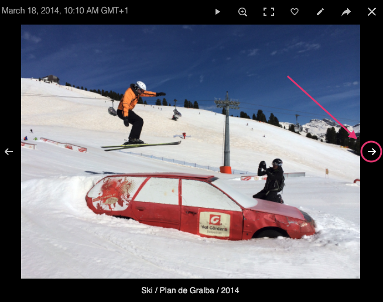
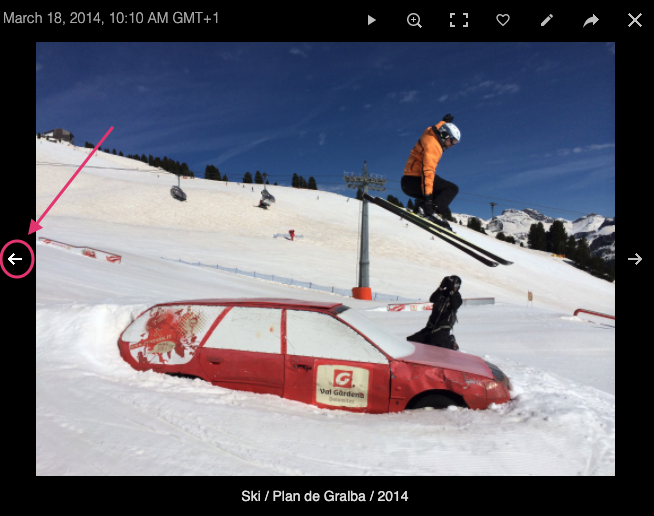
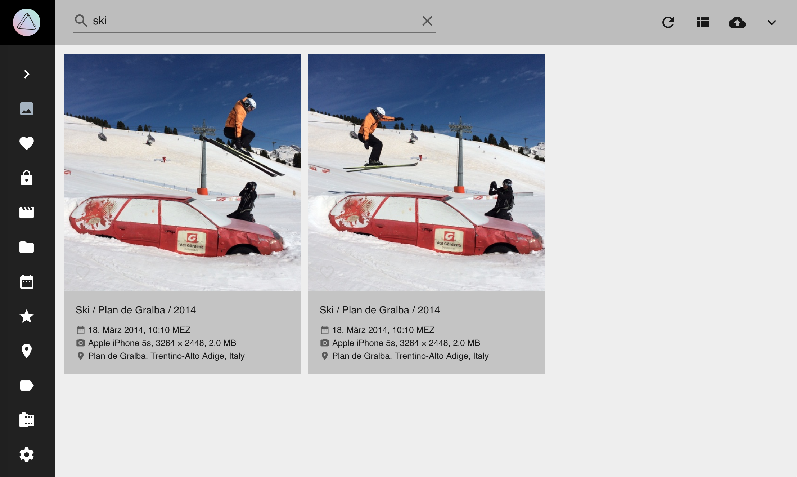

# Stacks #

If you have enabled *Stacks* in [*Settings*](../settings/library.md), you may come across photos that have more than 
one image file associated with them.

To show all photos with a group of related files, open *Stacks* in the expanded *Search* navigation:

### For what reasons can files be stacked? ###

1. Files sharing exactly the same file and folder name will always be stacked, for example `/2018/IMG_1234.jpg` and `/2018/IMG_1234.avi`
2. Files with related, sequential names like `/2018/IMG_1234 (2).jpg` and `/2018/IMG_1234 (3).jpg` may be stacked as well (optional)
3. Metadata suggests files have been taken at the same location and second (optional)
4. File metadata contains the same *Unique Image ID* or *XMP Instance ID* (optional)
 
You can change the behaviour for 2 - 4 in [*Settings*](../settings/library.md).

### Browse Related Files ###

1. Click on :material-camera-burst:

    
    
2. Use arrows to see all photos of the sequence

     
   

### Change Primary Files ###

The JPEG file marked as *primary* is used in our views. It is listed first in the files tab.

To change the primary file:

1. Open the photos [*edit dialog*](edit.md)

2. Open *Files* tab

3. Click :material-chevron-down: of the file you want to set as primary
        
4. Click *primary*

       

### Unstack Files ###

1. Open the photos [*edit dialog*](edit.md)

2. Open *Files* tab

3. Click :material-chevron-down: of the JPEG file that is not marked as primary
        
4. Click *unstack*

      

Now, both files appear in our views.

### Delete Non-Primary Files ###

1. Open the photos [*edit dialog*](edit.md)

2. Open *Files* tab

3. Click :material-chevron-down: of the JPEG file that is not marked as primary
        
4. Click *delete*

5. Confirm

      