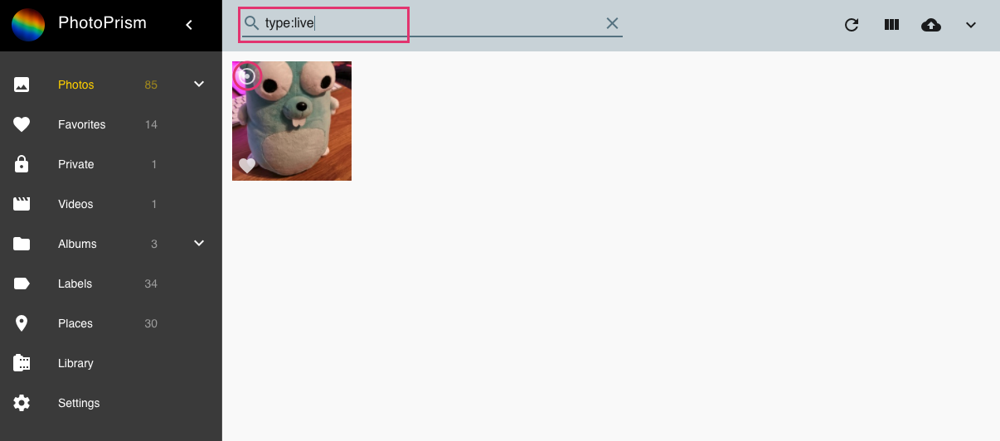

# Browsing and Playing Videos

Navigate to *Videos* to browse all your videos. To play a video, click :material-play:.
Videos in MPEG-4 AVC format can be played natively by virtually all modern browsers.

Other video formats are [automatically transcoded](#transcoding) in the background with [FFmpeg](https://www.ffmpeg.org/documentation.html)
so that they can be played without causing any problems, even if your browser might support the format.


## Live Photos ##

Short videos up to 3 seconds are categorized and displayed as *Live Photos*, regardless of your phone's make and model.
You can recognize this by the :material-adjust: icon that appears in the upper left corner.

Move the mouse cursor over the thumbnail to play the video without changing the view.
You can limit a search to *Live Photos* by using the `type:live` filter or the keyword `live`.



## Transcoding ##

Videos in formats other than AVC are transcoded on demand. This can cause unacceptable delays when large video files
are played for the first time.

In that case, you may [run the following command in a terminal](../../getting-started/docker-compose.md#command-line-interface)
to pre-transcode all video originals if needed:

```
docker-compose exec photoprism photoprism convert
```

!!! note ""
    Make sure that there is enough disk space available on your server before transcoding all video files, as this may
    require a significant amount of extra storage.

!!! tldr ""
    HEVC video files can have a `.mp4` file extension too, which is typically associated with AVC. This is because MP4 is a
    *container* format, meaning that the actual video content may be compressed with H.264, H.265, or something else.
    The file extension doesn't really tell you anything other than that it's probably a video file.

*[HEVC]: H.265 / High Efficiency Video Coding